# Guided Lab: GitHub Copilot SDK & Agent Merge — Agentic Developer Workflows

### Overall Estimated Duration: 4 Hours

## Lab Scenario

**Contoso Traders** runs the Galactic Gadget Shop — an online storefront selling anti-gravity coffee mugs, refurbished jetpacks, and everything in between. Business is booming, but the engineering team is drowning: the pull request backlog keeps growing, security reviews take days, and routine chores like issue triage eat entire afternoons.

You are a **Platform Engineer** on Contoso's developer experience team. Leadership has asked you to pilot the agentic capabilities GitHub announced at Build 2026 — the Copilot SDK, the redesigned Copilot CLI, and Agent Merge — and prove that agents can take over the repetitive work **safely and audibly** before the company rolls them out to every team.

Over the next four hours, you'll take one small codebase — the Galactic Gadget Shop API — all the way from "agents can read my code" to "agents ship my code under enterprise governance."

## Lab Overview

This guided lab provides practical, hands-on experience with **GitHub Copilot SDK & Agent Merge: Agentic Developer Workflows**. You will build agentic developer workflows with the GitHub Copilot SDK in Python and Node.js, run AI-driven security reviews, drive agents from the redesigned Copilot CLI with voice and scheduling, and configure Agent Merge governance and audit in GitHub Enterprise Cloud — everything announced at Microsoft Build 2026.

## Lab Objectives

By the end of this lab, you will be able to:

- **Module 1: Copilot SDK Foundations - Python** — Set up the GitHub Copilot SDK (GA) in a Python project, build a first agentic developer workflow, and understand the core SDK concepts that carry across all supported languages.
- **Module 2: Multi-Language SDK & /security-review Skill - Node.js** — Port the workflow to the Copilot SDK for Node.js, enable and run the `/security-review` skill against a codebase, and compare SDK behavior across the two languages.
- **Module 3: Copilot CLI: TUI, Voice & /every Scheduling** — Navigate the redesigned Copilot CLI text-based UI, drive the CLI with voice input, and schedule recurring agent runs with `/every`, backed by GitHub Actions.
- **Module 4: Agent Merge Configuration & Audit** — Configure Agent Merge for multi-agent pull request workflows, review merge decisions and governance policy in GitHub Enterprise Cloud, and audit agent-driven changes for compliance.

## Prerequisites

Participants should have:

- Working knowledge of Git and GitHub (clone, branch, commit, pull request)
- Basic familiarity with Python and JavaScript/Node.js
- Comfort working in a terminal and in Visual Studio Code

> **Note:** All tools you need — Visual Studio Code, Git, Node.js, Python, and the GitHub Copilot CLI — are pre-installed on your lab virtual machine. You do not need to install anything on your own computer.

## Architecture

Your lab VM is a Windows JumpVM with the full developer toolchain pre-installed. You sign in to a **GitHub Enterprise Cloud** organization through Microsoft Entra single sign-on, where your account holds a **GitHub Copilot Business** seat. The lab codebase — the Galactic Gadget Shop API — lives in your GitHub account. In Modules 1 and 2, Copilot SDK agents run locally on the VM against the cloned repository. In Module 3, the Copilot CLI schedules recurring agent runs, backed by a GitHub Actions workflow in the repository. In Module 4, the Copilot cloud agent and Agent Merge operate on pull requests in GitHub Enterprise Cloud, with every agent action recorded in the enterprise audit log.

## Architecture Diagram

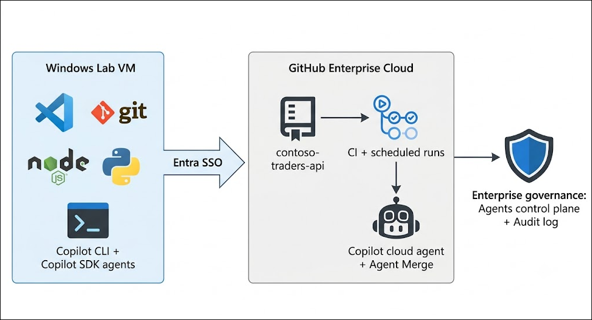

> **Image-generation prompt:** *A clean, professional cloud architecture diagram on a white background. Left: a Windows lab VM box containing icons for VS Code, Git, Node.js, Python, and a terminal labeled "Copilot CLI + Copilot SDK agents". Center: an arrow labeled "Entra SSO" pointing to a GitHub Enterprise Cloud box containing a repository icon labeled "contoso-traders-api", a GitHub Actions icon labeled "CI + scheduled runs", and a robot icon labeled "Copilot cloud agent + Agent Merge". Right: a shield icon labeled "Enterprise governance: Agents control plane + Audit log". Flat design, GitHub dark-gray and blue color palette, labeled arrows showing flow from developer to repository to governance.*

## Explanation of Components

- **GitHub Copilot SDK (GA)** — A multi-language SDK (Python, Node.js/TypeScript, Go, .NET, Rust, Java) that exposes the same agent runtime Copilot itself uses — planning, tool invocation, file edits, sessions, and streaming — as an embeddable library for your own applications.
- **GitHub Copilot CLI** — Copilot's terminal experience, refreshed at Build 2026 with a redesigned text-based UI (TUI), tabs for Issues/Pull requests/Gists, local voice input, the `/rubber-duck` critic, and prompt scheduling via `/every` and `/after`.
- **/security-review skill** — An experimental Copilot CLI command that scans your local code changes for high-impact vulnerabilities across 11 categories and returns severity- and confidence-scored findings with actionable fixes.
- **Copilot cloud agent** — GitHub's hosted coding agent. Assign it an issue and it plans, codes, and opens a pull request on its own runner.
- **Agent Merge** — Follows a pull request through review and integration: monitors CI, tracks required reviewers, addresses failing checks, and completes the merge when your conditions are met — at the automation level you choose.
- **GitHub Enterprise Cloud governance** — The enterprise **Agents** control plane for managing agent availability and sessions, plus the audit log where every agent action is recorded with an `actor_is_agent` identifier and the user it acted on behalf of.
- **GitHub Actions** — Runs the repository's CI on every pull request (the checks Agent Merge drives to green) and backs scheduled agent runs.

## Getting Started with the Lab

Welcome to the GitHub Copilot SDK & Agent Merge lab! Use this guide to set up your environment; the modules that follow build on each other, so complete them in order.

## Accessing Your Lab Environment

> **Important — Disconnect VPN before launching the lab:** If you are connected to a corporate or personal VPN, please **disconnect it before accessing the lab environment**. Active VPN connections are a known cause of disconnections, slow loading, and authentication failures while accessing the virtual machine and GitHub.

Once you're ready to dive in, your virtual machine and lab **Guide** will be right at your fingertips within your web browser.

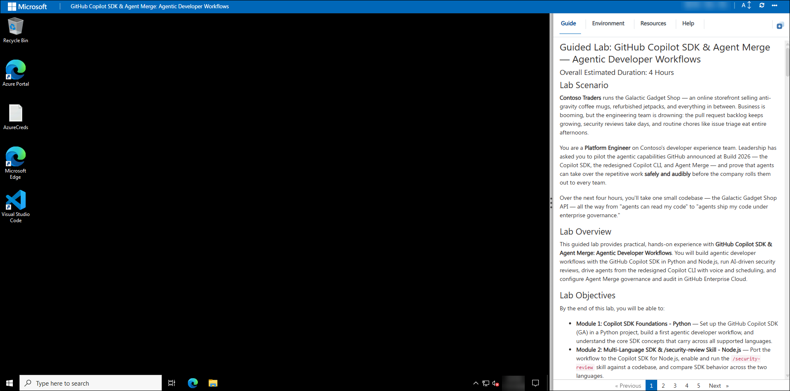

## Virtual Machine & Lab Guide

Your virtual machine is your workhorse throughout the lab. The lab guide is your roadmap to success.

## Exploring Your Lab Resources

To get a better understanding of your lab resources and credentials, navigate to the **Environment** tab.

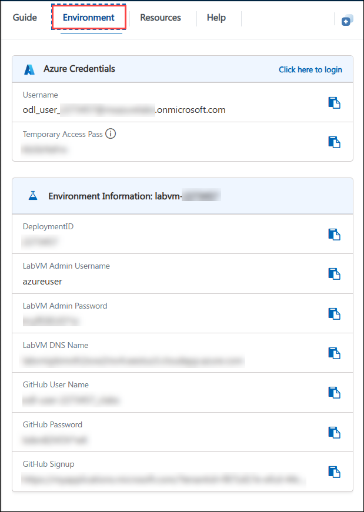

## Utilizing the Split Window Feature

For convenience, you can open the lab guide in a separate window by selecting the **Split Window** button from the top right corner.

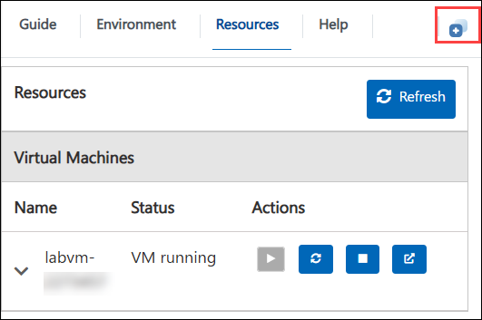

## Lab Guide Zoom In/Zoom Out

To adjust the zoom level for the environment page, click the **A↕** icon located next to the timer in the lab environment.

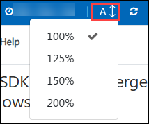

## Managing Your Virtual Machine

Feel free to **Start, Stop, or Restart (2)** your virtual machine as needed from the **Resources (1)** tab. Your experience is in your hands!

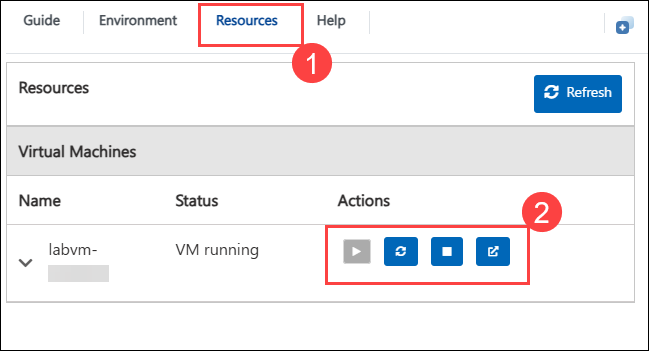

## Login to GitHub

1. In the Lab VM, open the **Microsoft Edge** browser from the desktop.

   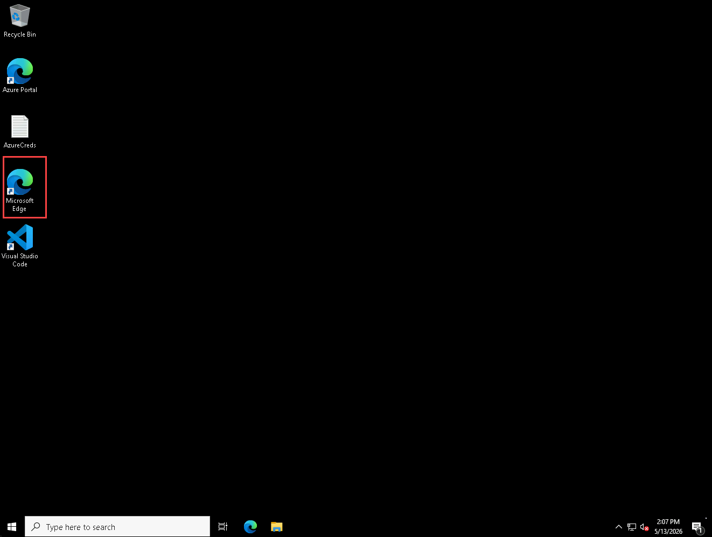

1. In a new tab, navigate to the **GitHub login** page by copying and pasting the following URL into the address bar:

   ```
   https://github.com/login
   ```

1. On the Sign in to GitHub tab, enter the provided **GitHub User Name (1)** in the input field, and click on **Sign in with your identity provider (2)**.

   - **Email/Username:** <inject key="GitHub User Name" enableCopy="true"/> **(1)**

     

   > **Note:** After entering the **GitHub User Name**, ensure you click **Sign in with your identity provider (2)**. Do not enter a password — this CloudLabs GitHub account is provisioned through the organization's identity provider, and standard password login is not supported.

1. Click on **Continue** on the **Single sign-on to CloudLabs Organizations** page to proceed.

   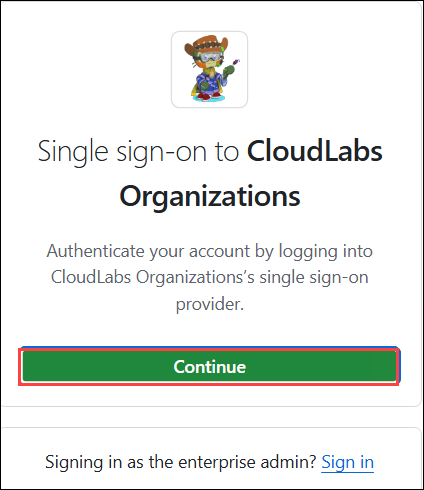

1. You will see the **Sign in** tab. Here, enter your Microsoft Entra credentials and click **Next (2)**.

   - **Email/Username:** <inject key="AzureAdUserEmail"></inject> **(1)**

     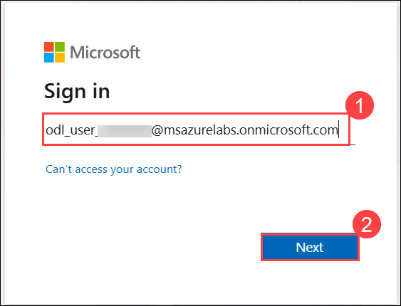

1. Next, provide your Temporary Access Pass and click on **Sign in (2)**.

   - **Temporary Access Pass:** <inject key="AzureAdUserPassword"></inject> **(1)**

     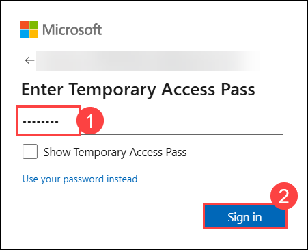

1. On the **Permissions requested by** pop-up, click on **Accept**.

   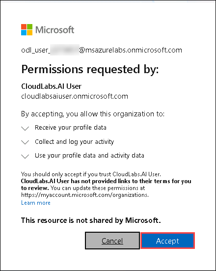

1. On the **Stay signed in?** pop-up, click on **No**.

   

1. You are now successfully logged in to **GitHub** and have been redirected to the **GitHub homepage**.

   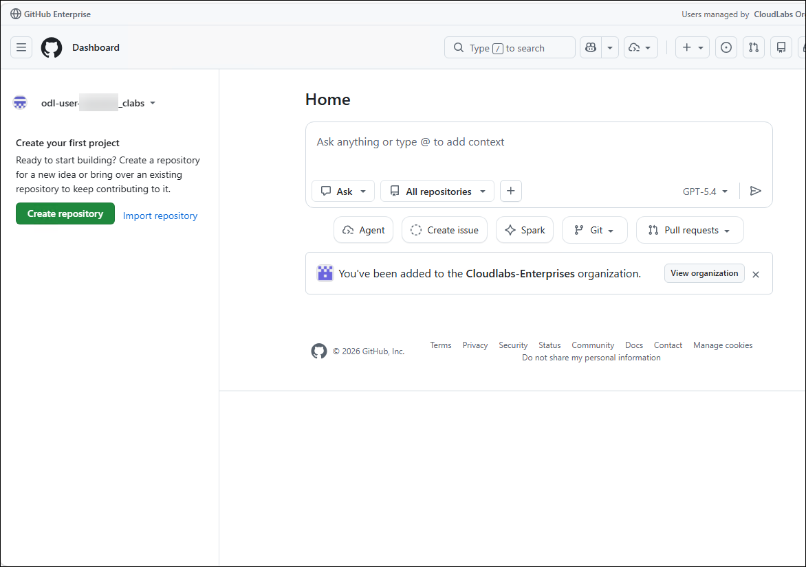

> **Note:** Keep this browser session signed in for the entire lab — every module uses it. Your account already includes a **GitHub Copilot Business** seat; you'll confirm it works in Module 1.

## Support Contact

The CloudLabs support team is available 24/7, 365 days a year, via email and live chat to ensure seamless assistance at any time. We offer dedicated support channels tailored specifically for both learners and instructors, ensuring that all your needs are promptly and efficiently addressed.

Learner Support Contacts:

- Email Support: cloudlabs-support@spektrasystems.com
- Live Chat Support: https://cloudlabs.ai/labs-support

### Now, click on **Next** from the lower right corner to move on to the next page.


## Happy Learning!
