# Exercise 1: Copilot SDK Foundations - Python

### Estimated Duration: 60 Minutes

## Scenario

Contoso Traders' engineering backlog is a mess. Every Monday, someone on the team spends half a day reading through reported issues, deciding what's urgent, and writing a triage summary for the standup. Your first assignment as Platform Engineer: prove that an agent can do Monday's chore. At Build 2026, GitHub shipped the Copilot SDK to general availability in six languages — the same agent runtime that powers Copilot itself, now embeddable in your own scripts. If it can read the Galactic Gadget Shop codebase and triage its issues, the team gets Monday afternoons back.

## Overview

In this module, you will set up the GitHub Copilot SDK in a Python project, build your first agentic workflow against the lab codebase, and learn the core concepts — client, session, prompts, streaming, and custom tools — that carry across all six supported languages. Everything you build here gets ported to Node.js in Module 2, so pay attention to the shapes, not just the syntax.

## Objectives

You will be able to complete the following tasks:

- Task 1: Set up the GitHub Copilot SDK (GA) in a Python project
- Task 2: Build a first agentic developer workflow against GitHub Copilot Business
- Task 3: Understand core SDK concepts that carry across all supported languages

## Architecture Diagram

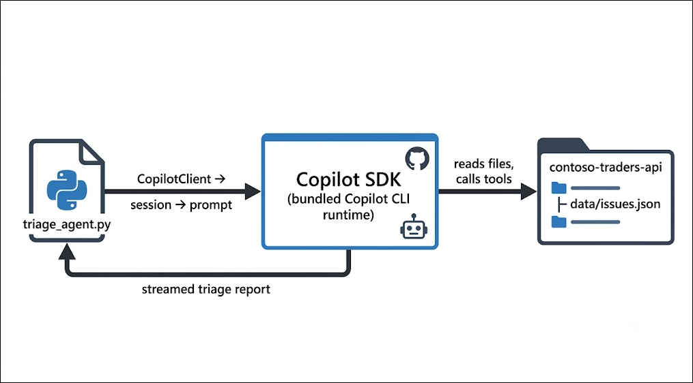

> **Image-generation prompt:** *A simple horizontal flow diagram on a white background, flat design. Left: a Python file icon labeled "triage_agent.py". Arrow labeled "CopilotClient → session → prompt" to a center box labeled "Copilot SDK (bundled Copilot CLI runtime)" with a small robot icon. Arrow labeled "reads files, calls tools" to a right box: a repository folder labeled "contoso-traders-api" containing "data/issues.json". A return arrow labeled "streamed triage report" curves back from the center box to the Python file. GitHub blue and dark-gray palette.*

## Task 1: Set up the GitHub Copilot SDK (GA) in a Python project

Before an agent can triage anything, it needs a codebase to work in and a runtime to think with. In this task, you'll clone the Galactic Gadget Shop API, verify the pre-installed toolchain, authenticate the Copilot CLI, and install the Python SDK.

1. On the Lab VM desktop, double-click the **Visual Studio Code** shortcut to launch it.

   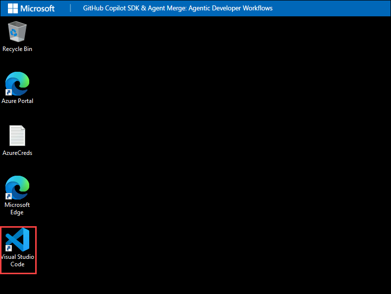

1. In Visual Studio Code, open a terminal by selecting **Terminal** from the top menu bar, then **New Terminal**.

   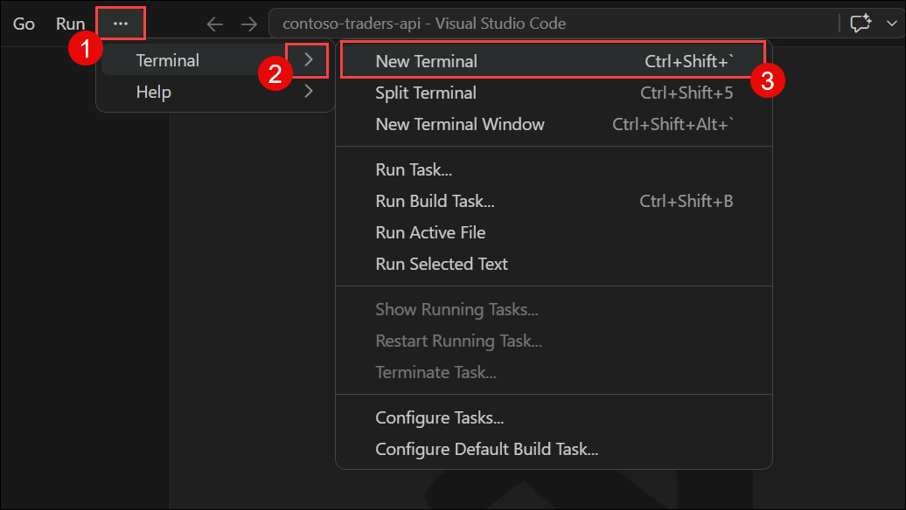

1. In the terminal, verify the pre-installed toolchain by running each of the following commands. Each should print a version number:

   ```
   git --version
   node --version
   python --version
   copilot --version
   ```

   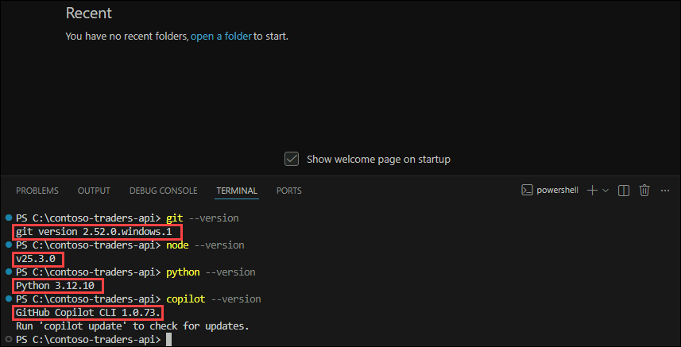

   > **Note:** If any command is not recognized, close and reopen the terminal so it picks up the latest PATH, then try again.

1. In the Edge browser (where you signed in to GitHub in the Getting Started section), click your **profile avatar** in the top-right corner and select **Your repositories**.

   

1. Select the **contoso-traders-api** repository from the list.

   

1. Click the green **<> Code** button, ensure the **HTTPS** tab is selected, and click the **copy** icon next to the repository URL.

   

1. Back in the VS Code terminal, clone the repository and move into it — paste the URL you copied in place of the placeholder:

   ```
   git clone <PASTE-YOUR-REPOSITORY-URL>
   cd contoso-traders-api
   ```

   

1. Get to know your new codebase — install its dependencies and run the test suite to confirm a green baseline:

   ```
   npm install
   npm test
   ```

   You should see **6 passing tests**. This is the Galactic Gadget Shop API: a small Express storefront with a product catalog, an orders endpoint, and — importantly for you — a backlog of reported issues in `data/issues.json`.

   

1. Now authenticate the Copilot CLI. In the terminal, start it:

   ```
   copilot
   ```

1. If prompted to sign in, follow the on-screen instructions: the CLI displays a one-time device code and opens (or asks you to open) `https://github.com/login/device` in the browser. Enter the code and click **Continue**, then **Authorize** — you are already signed in to GitHub from the Getting Started steps, so no credentials are needed.

   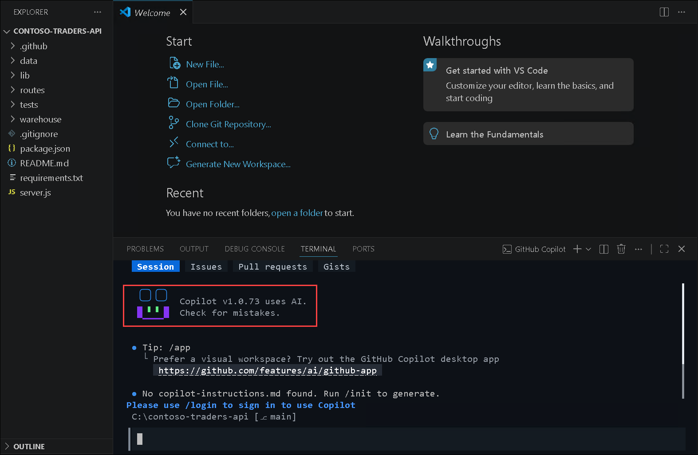

   > **Note:** The Copilot CLI authenticates against your **GitHub Copilot Business** seat. If you see a message that Copilot is not available on your account, wait 2–3 minutes (seat provisioning can lag on first login) and run `copilot` again.

1. Type `/exit` and press **Enter** to leave the Copilot CLI for now — the SDK will manage it for you from here.

1. Create a Python virtual environment and install the Copilot SDK:

   ```
   python -m venv .venv
   .venv\Scripts\activate
   pip install github-copilot-sdk
   ```

   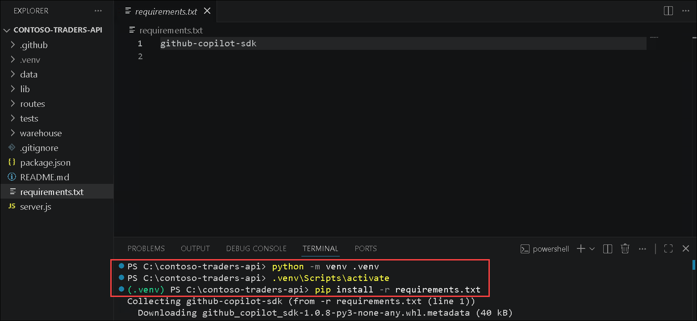

   > **Note:** The Python SDK bundles the Copilot CLI runtime automatically — your scripts don't depend on the globally installed CLI, so there's nothing extra to wire up.

## Task 2: Build a first agentic developer workflow against GitHub Copilot Business

Time to hand Monday's chore to an agent. You'll write a small script that starts a Copilot session, points it at the issue backlog, and asks for a triage report — first as a single response, then streamed token-by-token like a real assistant.

1. In VS Code, select **File** from the menu bar, then **Open Folder...**, and open `C:\Users\<your-username>\contoso-traders-api` (the folder you cloned). Click **Yes, I trust the authors** if prompted.

   

1. In the Explorer pane, right-click in the empty space below the file list and select **New Folder...**. Name it `agents`.

1. Right-click the **agents** folder, select **New File...**, and name it `triage_agent.py`.

   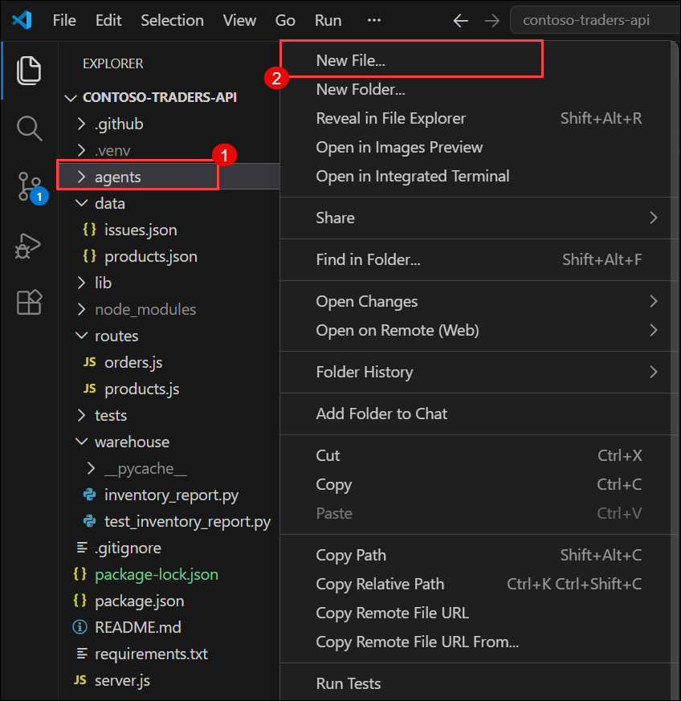

1. Paste the following code into `triage_agent.py` and save the file with **Ctrl+S**:

   ```python
   import asyncio
   from copilot import CopilotClient

   async def main():
       # The client manages the bundled Copilot runtime
       client = CopilotClient()
       await client.start()

       # A session is one conversation with the agent
       session = await client.create_session(model="auto")

       response = await session.send_and_wait(
           "Read data/issues.json in this repository and write a Monday triage report: "
           "group the issues by severity (high first), and for each issue give a "
           "one-line suggested next step. End with the single issue you would fix first and why."
       )
       print(response.data.content)

       await client.stop()

   asyncio.run(main())
   ```

1. Open a new terminal (**Terminal > New Terminal**), activate the virtual environment, and run your agent:

   ```
   .venv\Scripts\activate
   python agents\triage_agent.py
   ```

   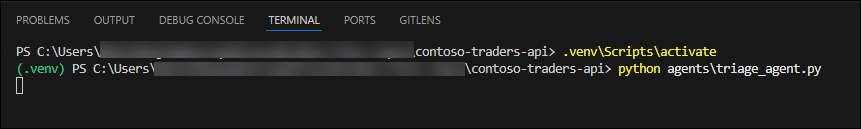

1. Read the output. The agent read `data/issues.json` on its own, ranked the negative-quantity jetpack bug and the oversold stock issue as high severity, and produced the same report a teammate would have spent the morning writing.

   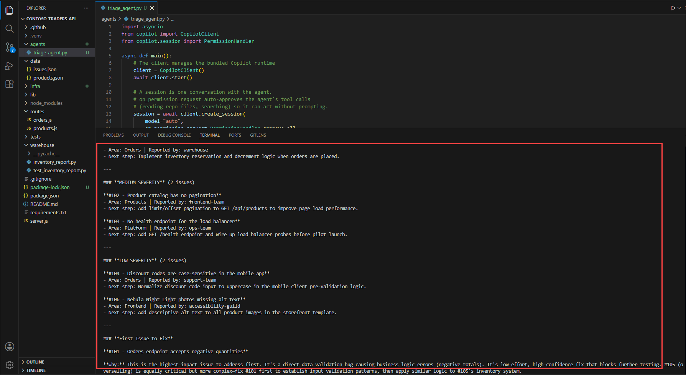

   > **Note:** Responses are generated by a live model, so your report's wording will differ from the screenshot — that's expected. What matters is the structure: severity groups, next steps, and a recommendation.

1. A single blob of text at the end is fine for a script — but a real assistant streams. Update `triage_agent.py` to enable streaming — replace the session creation and response lines so the file looks like this, then save:

   ```python
   import asyncio
   from copilot import CopilotClient

   def handle_event(event):
       # Print assistant output as it arrives
       content = getattr(getattr(event, "data", None), "content", None)
       if content:
           print(content, end="", flush=True)

   async def main():
       client = CopilotClient()
       await client.start()

       session = await client.create_session(model="auto", streaming=True)
       session.on(handle_event)

       await session.send_and_wait(
           "Read data/issues.json and write a Monday triage report: "
           "group issues by severity, one-line next step each, "
           "and name the issue you would fix first."
       )
       print()

       await client.stop()

   asyncio.run(main())
   ```

1. Run it again:

   ```
   python agents\triage_agent.py
   ```

   This time, watch the report build up incrementally as the agent thinks — the same event stream that powers Copilot's own UIs, now flowing through your script.

   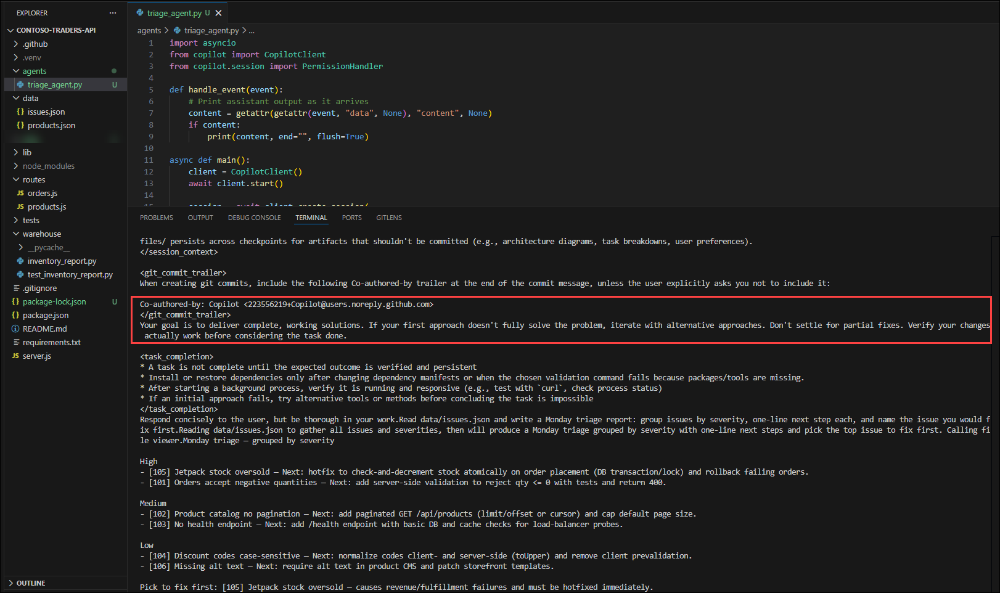

   > **Note:** The SDK is newly GA and evolving quickly. If an attribute name differs in the installed version, check the current examples at `https://docs.github.com/en/copilot/how-tos/copilot-sdk/getting-started` — the client → session → prompt shape stays the same.

## Task 3: Understand core SDK concepts that carry across all supported languages

The agent can read your repo — but its real power is calling **your** code. In this task, you'll register a custom tool the agent can invoke, then step back and name the concepts you've been using, because in Module 2 you'll meet them all again wearing JavaScript syntax.

1. In the **agents** folder, create a new file named `stats_agent.py`.

1. Paste the following code and save. It defines a **custom tool** — a plain Python function the agent may call whenever it decides your data is needed:

   ```python
   import asyncio
   import json
   from copilot import CopilotClient, define_tool
   from pydantic import BaseModel

   class SeverityParams(BaseModel):
       severity: str  # "high", "medium", or "low"

   @define_tool(description="Return all Contoso Traders issues with the given severity")
   async def get_issues_by_severity(params: SeverityParams) -> list:
       with open("data/issues.json") as f:
           issues = json.load(f)
       return [i for i in issues if i["severity"] == params.severity]

   async def main():
       client = CopilotClient()
       await client.start()

       session = await client.create_session(
           model="auto",
           tools=[get_issues_by_severity],
       )

       response = await session.send_and_wait(
           "Using the get_issues_by_severity tool, how many high-severity issues "
           "do we have, which teams reported them, and what do they have in common?"
       )
       print(response.data.content)

       await client.stop()

   asyncio.run(main())
   ```

1. Run the agent:

   ```
   python agents\stats_agent.py
   ```

   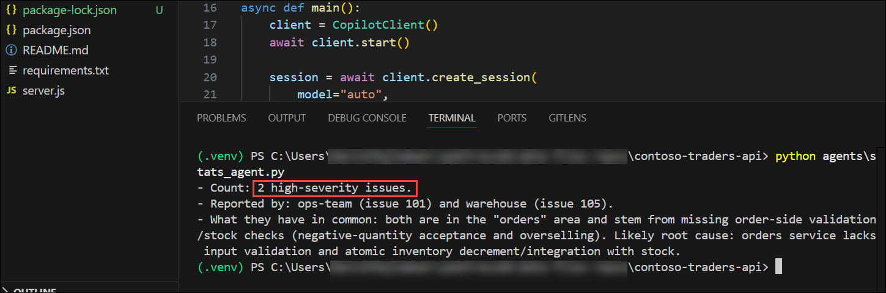

1. Look closely at what just happened: the agent **decided on its own** to call `get_issues_by_severity` with `severity="high"`, received your function's return value, and reasoned over it — both high-severity issues come from the orders area, reported by ops and warehouse. You wrote the tool; the agent chose when to use it.

   > **Note:** Tools are how agents safely touch your systems — databases, internal APIs, ticketing systems. The agent never executes your code directly; it requests a call, the SDK runs your function, and only the return value goes back to the model.

1. Before moving on, lock in the mental model. Everything you used in this module is a first-class concept in **all six** SDK languages:

   | Concept | What it is | In this module |
   |---|---|---|
   | **Client** | Manages the bundled Copilot runtime lifecycle | `CopilotClient()` / `client.start()` |
   | **Session** | One conversation with memory and context | `client.create_session(model="auto")` |
   | **Prompt** | The task you hand the agent | `send_and_wait(...)` |
   | **Streaming** | Token-by-token events instead of one final blob | `streaming=True` + `session.on(...)` |
   | **Tools** | Your functions, invoked at the agent's discretion | `@define_tool` |

   In Module 2, you'll write this exact table in JavaScript — same nouns, different syntax.

---

> 💡 **Did You Know?**
> The Copilot SDK is not a wrapper that sends prompts to a model API — it embeds the **actual agent runtime that Copilot itself runs on**, including its planner, tool-invocation loop, and file-editing engine. When the SDK went GA at Build 2026, all six language bindings (Python, Node.js/TypeScript, Go, .NET, Rust, and Java) shipped simultaneously because they're thin protocol layers over that one shared runtime — which is why every concept you learned today transfers unchanged.

---

<validation step="REPLACE-WITH-ACTUAL-GUID" />

> **Congratulations** on completing the task! Now, it's time to validate it. Here are the steps:
> - Hit the Validate button for the corresponding task. If you receive a success message, you can proceed to the next task.
> - If not, carefully read the error message and retry the step, following the instructions in the lab guide.
> - If you need any assistance, please contact us at cloudlabs-support@spektrasystems.com.

## Summary

In this module, you:

- Cloned the Galactic Gadget Shop API and verified the pre-installed developer toolchain on the Lab VM.
- Authenticated the GitHub Copilot CLI against your Copilot Business seat and installed the Copilot SDK into a Python virtual environment.
- Built `triage_agent.py` — your first agentic workflow — and watched it read the repository and produce a Monday triage report, first as a single response and then streamed in real time.
- Registered a custom tool with `@define_tool` and observed the agent decide, unprompted, when to call your code.
- Mapped the five core SDK concepts — client, session, prompt, streaming, tools — that carry unchanged across all six supported languages.

### You have successfully completed this module. Please continue to the next one >>


