# Exercise 2: Multi-Language SDK & /security-review Skill - Node.js

### Estimated Duration: 60 Minutes

## Scenario

Your Python triage agent was a hit with the warehouse team — but Contoso's storefront team lives in JavaScript, and they won't adopt anything that isn't `npm install`-able. Meanwhile, a bigger problem just landed on your desk: during an archive cleanup, someone found the **legacy coupon service** from the 2019 storefront, and the team wants to bring it back for the summer sale. It **hasn't seen a security review** in seven years. Today you prove two things: that your Module 1 workflow ports to Node.js in minutes, and that Copilot's new `/security-review` skill can catch what seven years of neglect left behind — before the coupon service ships.

## Overview

In this module, you will port the Python triage agent to the Copilot SDK for Node.js, observing that the client → session → prompt shape survives the language change untouched. Then you'll resurrect the legacy coupon service and run the experimental `/security-review` skill against it, triaging real severity- and confidence-scored findings. Finally, you'll run both agents side by side and compare SDK behavior and output across the two languages.

## Objectives

You will be able to complete the following tasks:

- Task 1: Port the Module 1 workflow to the Copilot SDK for Node.js
- Task 2: Enable and run the /security-review skill against a codebase
- Task 3: Compare SDK behavior and output across the two languages

## Architecture Diagram

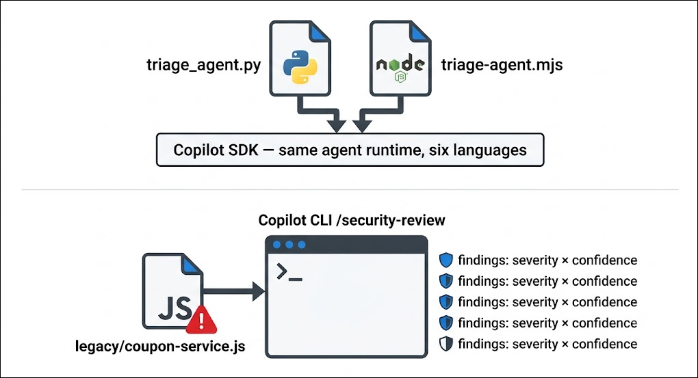

## Task 1: Port the Module 1 workflow to the Copilot SDK for Node.js

Same agent, new passport. The Copilot SDK's six language bindings are thin layers over one shared runtime — so porting the triage agent is a translation exercise, not a rewrite. Fifteen minutes from `pip` to `npm`.

1. In VS Code (with the **contoso-traders-api** folder still open), open a terminal via **Eclipse (1) > Terminal (2) > New Terminal (3)**.

   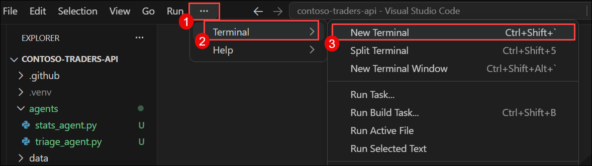

1. So far you've lived on the warehouse (Python) side of the codebase. Meet the storefront half — install the Node.js dependencies and run its test suite to confirm a green baseline:

   ```
   npm install
   npm test
   ```

   You should see **6 passing tests** covering the cart and discount logic that powers `routes/orders.js`.

   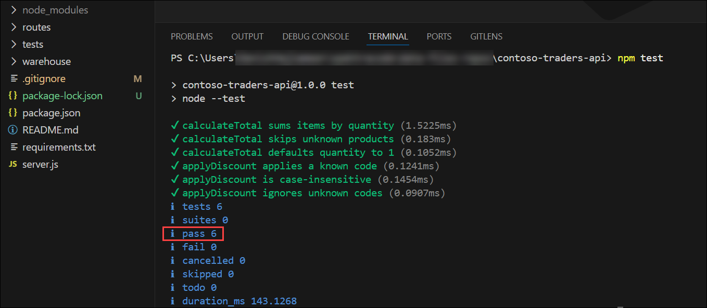

1. Install the **Copilot SDK** for Node.js:

   ```
   npm install @github/copilot-sdk
   ```

   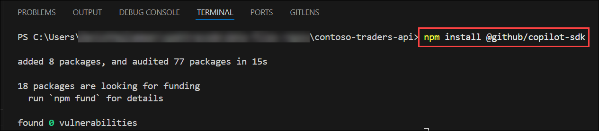

   > **Note:** Just like the Python package, the Node.js SDK bundles the Copilot CLI runtime — no separate installation or wiring needed.

1. In the Explorer pane, click the **new file (1)** under the **agents (2)** folder, and name it `triage-agent.mjs` **(3)**.

   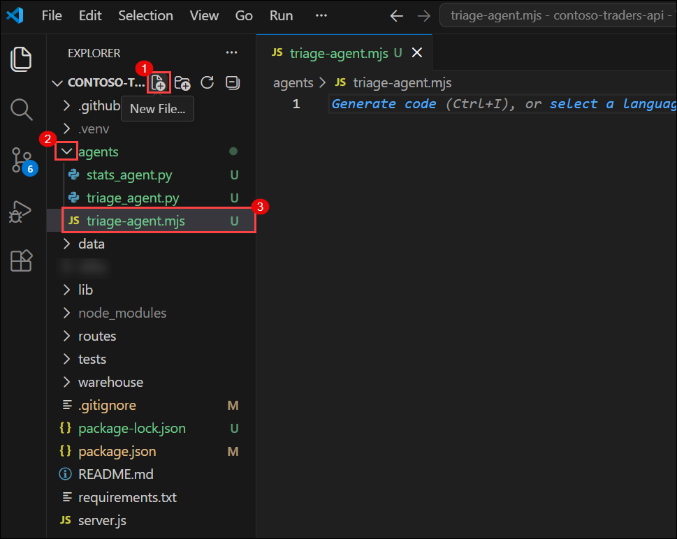

1. Paste the following code — read it side by side with `triage_agent.py` as you do — and save with **Ctrl+S**:

   ```javascript
   import { CopilotClient, approveAll } from "@github/copilot-sdk";

   // The client manages the bundled Copilot runtime
   const client = new CopilotClient();
   await client.start();

   // A session is one conversation with the agent.
   // onPermissionRequest: approveAll auto-approves the agent's tool calls
   // (reading repo files, searching) so it can act without prompting.
   const session = await client.createSession({
     model: "auto",
     onPermissionRequest: approveAll,
   });

   const response = await session.sendAndWait(
     "Read data/issues.json in this repository and write a Monday triage report: " +
       "group the issues by severity (high first), and for each issue give a " +
       "one-line suggested next step. End with the single issue you would fix first and why."
   );
   console.log(response.data.content);

   await client.stop();
   ```

1. Run your ported agent:

   ```
   node agents\triage-agent.mjs
   ```

   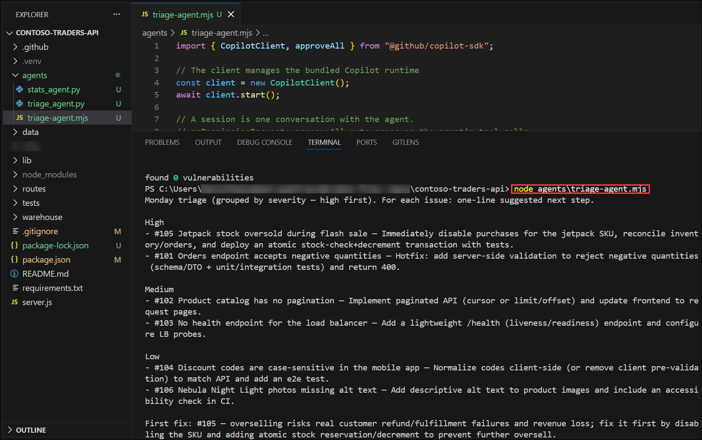

1. Compare the code you just wrote with the Python version. Every line maps one-to-one:

   | Python | Node.js |
   |---|---|
   | `client = CopilotClient()` | `const client = new CopilotClient()` |
   | `await client.start()` | `await client.start()` |
   | `client.create_session(model="auto")` | `client.createSession({ model: "auto" })` |
   | `session.send_and_wait(...)` | `session.sendAndWait(...)` |
   | `response.data.content` | `response.data.content` |

   The only real differences are naming conventions (`snake_case` vs `camelCase`) and each language's async idioms. The agent behavior — planning, file reading, response structure — is identical, because it's the same runtime underneath.

   > **Note:** The SDK is **newly GA** and its API surface is still being refined. If a method signature differs in the installed version, check `https://docs.github.com/en/copilot/how-tos/copilot-sdk` for the current Node.js examples — the concepts and structure remain the same.

## Task 2: Enable and run the /security-review skill against a codebase

The legacy coupon service is back from the archive — and it's a time capsule of 2019's worst habits. Before the storefront team wires it into the summer sale, you'll let Copilot's dedicated security reviewer read it. `/security-review` scans your **local code changes** and returns findings scored by severity and confidence, across 11 vulnerability categories.

1. In the Explorer pane, click the empty space and select **New Folder... (1)**, and name it `legacy` **(2)**. Right-click the **legacy** folder, select **New File...**, and name it `coupon-service.js` **(3)**.

   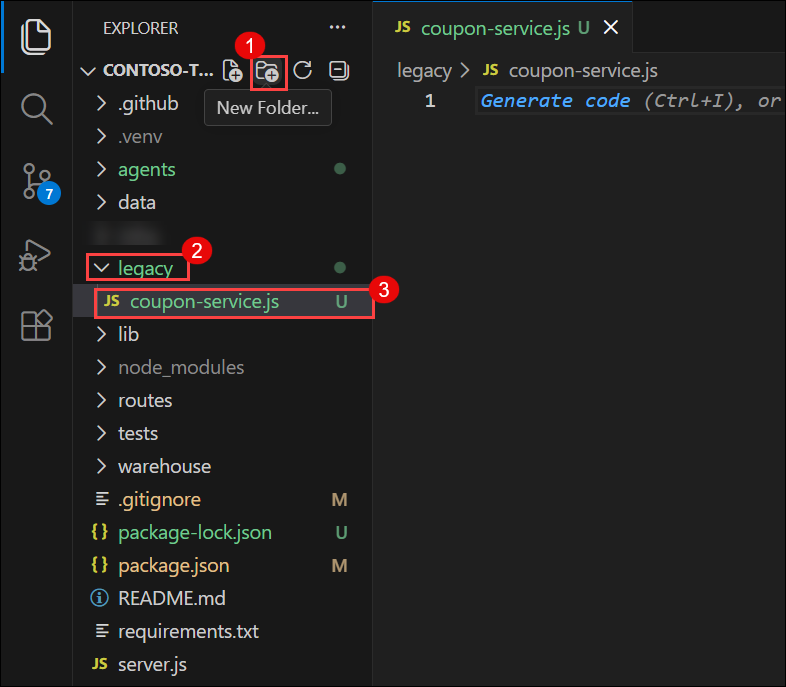

1. Paste the recovered 2019 code below into the file exactly as-is and save. **(Yes, it's bad. That's the point)**

   ```javascript
   const crypto = require("crypto");

   // Legacy coupon service — recovered from the 2019 storefront archive.
   // Wired to the partner discount database.
   const PARTNER_API_KEY = "ct_live_9f8e7d6c5b4a3210fedcba9876543210";

   const db = {
     query: (sql) => {
       console.log("[db]", sql);
       return [];
     },
   };

   // Look up a coupon by the code the customer typed at checkout
   function lookupCoupon(code) {
     const query = "SELECT * FROM coupons WHERE code = '" + code + "'";
     return db.query(query);
   }

   // Verify a partner webhook payload
   function verifyPartnerSignature(payload, signature) {
     const hash = crypto.createHash("md5").update(payload).digest("hex");
     return hash === signature;
   }

   // Partners send discount rules as strings, e.g. "total * 0.85"
   function applyPartnerRule(rule, total) {
     return eval(rule);
   }

   module.exports = { lookupCoupon, verifyPartnerSignature, applyPartnerRule, PARTNER_API_KEY };
   ```

   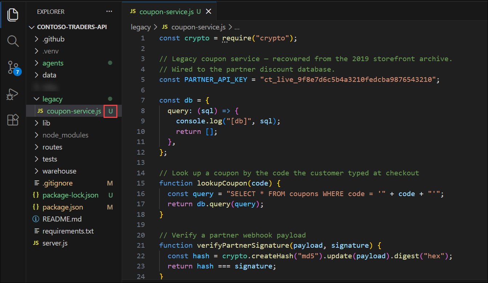

   > **Important:** Do not commit this file yet. `/security-review` analyzes your **uncommitted local changes** — the new file must still be pending in your working tree for the scan to pick it up. You can confirm with `git status`: `legacy/coupon-service.js` should appear as untracked **(U)**.

1. In the terminal, start the Copilot CLI from the repository root:

   ```
   copilot
   ```

1. `/security-review` ships as an experimental feature, so turn on experimental mode first. At the Copilot prompt, type the following and press **Enter**:

   ```
   /experimental on
   ```

   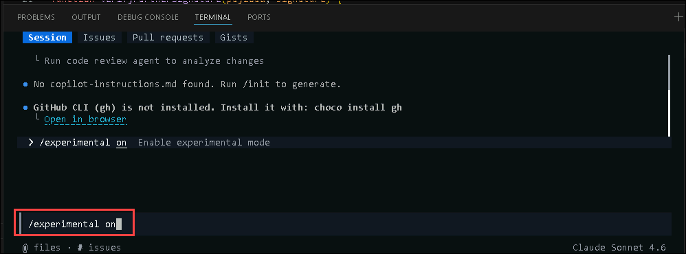

   > **Note:** If the CLI reports that `/security-review` is unavailable after enabling experimental mode, update the CLI by exiting (`/exit`) and running `copilot update`, then start it again.

1. Now run the security review:

   ```
   /security-review
   ```

   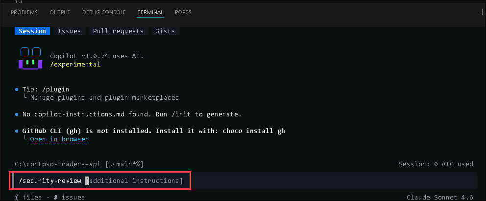

   You would be asked to allow permission for searching/executing a command to which u can enter on 'yes'

   The skill scans your pending changes and, after a short analysis, returns a list of findings — each with a **severity**, a **confidence score**, the affected file and line, and a suggested remediation.

   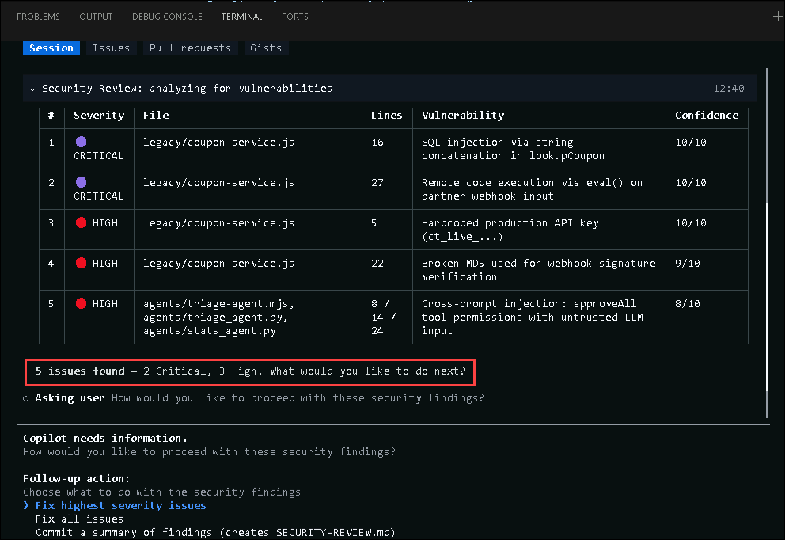

1. Read through the findings and match them against the code you pasted. You should recognize at least these four, drawn from the skill's 11 vulnerability categories:

   | Finding | Category | Where |
   |---|---|---|
   | Hardcoded credential (`PARTNER_API_KEY`) | Hardcoded credentials | line 5 |
   | SQL built by string concatenation | Injection flaws | `lookupCoupon` |
   | MD5 used for signature verification | Weak cryptography | `verifyPartnerSignature` |
   | `eval()` of externally supplied input | Injection flaws | `applyPartnerRule` |

1. Findings are only useful if they turn into **fixes**. 

   - Still inside the Copilot CLI, the Copilot would ask ur **permission to fix the issues**, you can click **enter** on fixing the highest severeity issues.

      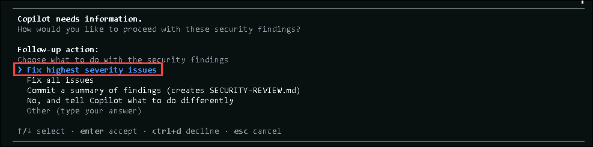

      > **Note:** You can review and approve the changes as required to make sure the faults are cleaned. The scan covers **all** your uncommitted changes, so alongside `legacy/coupon-service.js` you may also see Copilot flag and harden the new `agents/triage-agent.mjs` — approve those too; you'll see the effect of that hardening in Task 3.

1. Type a custom prompt by asking the agent to remediate the worst one — type the following prompt and press **Enter**:

   ```
   Fix the eval() injection in legacy/coupon-service.js: replace applyPartnerRule with a safe implementation that only supports percentage-off rules like "15%", and reject anything else.
   ```

   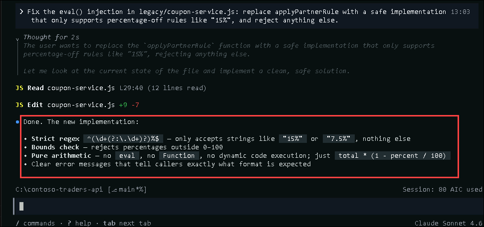

1. Review the diff Copilot proposes and approve the change when prompted. You can run `/security-review` once more and confirm the `eval` finding no longer appears (In ase you need more scrutiny).

   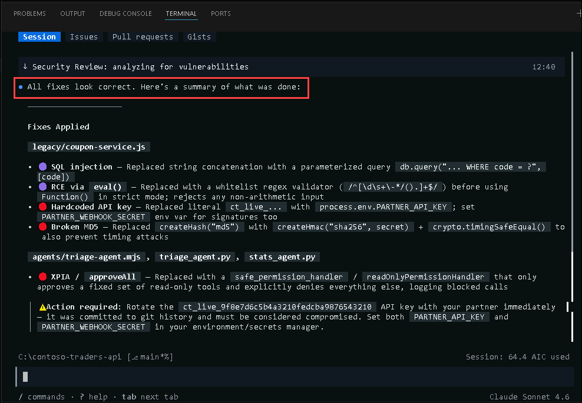

   > **Note:** This is the agentic security loop in miniature: **scan → triage → delegate the fix → re-scan** to verify. In **Exercise 4**, you'll see the same loop running server-side on pull requests, without you in the terminal at all.

## Task 3: Compare SDK behavior and output across the two languages

You now have the same agent in **two languages** — but they are no longer identical. When you ran `/security-review` in Task 2, the scan looked at **every** uncommitted change in your working tree, not just the coupon service. That included the brand-new `agents/triage-agent.mjs`, and Copilot flagged its `approveAll` handler as a risk: an agent that auto-approves *every* tool call can be steered by hostile text hidden in the data it reads. When you approved the fixes, Copilot **rewrote the Node agent's permission handler for you**. The Python agent was never in that scan, so it still auto-approves everything.

That asymmetry is the experiment: run the two agents back to back and watch what a Copilot-hardened binding does differently from an untouched one.

1. Open `triage-agent.mjs`and read what Copilot changed during the **Task 2 review**. The `approveAll` import and `onPermissionRequest: approveAll` are gone; in their place is an **allowlist** handler that permits only **read-only tools** and denies everything else:

   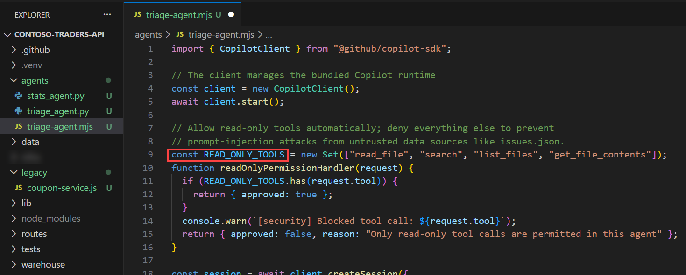

   > **Note:** This is a **fail-closed** handler — it approves a tool *only* when it can positively match the name against `READ_ONLY_TOOLS`, and denies in every other case. That's the correct security direction: an agent that reads untrusted data (`issues.json` could carry hostile instructions) must never be able to escalate to a write or shell tool on the strength of that data.

   > **If your file still shows `approveAll`:** the review didn't extend the fix to your agent. Restart the Copilot CLI (`copilot`) and run this prompt, then approve the diff: `Harden agents/triage-agent.mjs — replace the approveAll permission handler with one that allows only read-only tools (read_file, search, list_files, get_file_contents) and denies everything else, logging blocked calls.`

1. Run both agents **back to back in the terminal** (make sure your **Python virtual environment** is still **active** for the first command):

   ```
   python agents\triage_agent.py
   node agents\triage-agent.mjs
   ```

   > **Hint:** Use the split terminal window to see the comparison

1. Read the two terminals **side by side** — they now **diverge**, and that divergence is the finding:

   - **Python (left)** still **auto-approves**, so it reads `data/issues.json` unprompted and prints a full Monday triage report — issues grouped by severity, a next step per issue, and a pick for what to fix first.
   - **Node (right)** refuses. Copilot's hardened handler can't confirm the incoming tool against its allowlist, so it denies — you'll see `[security] Blocked tool call` for each attempt. Cut off from the repo, the agent doesn't crash or invent data: it reports that it's blocked and **asks you to paste the file contents** so it can still produce the report. That graceful, no-repo-access fallback *is* the deny-by-default posture working as intended.

      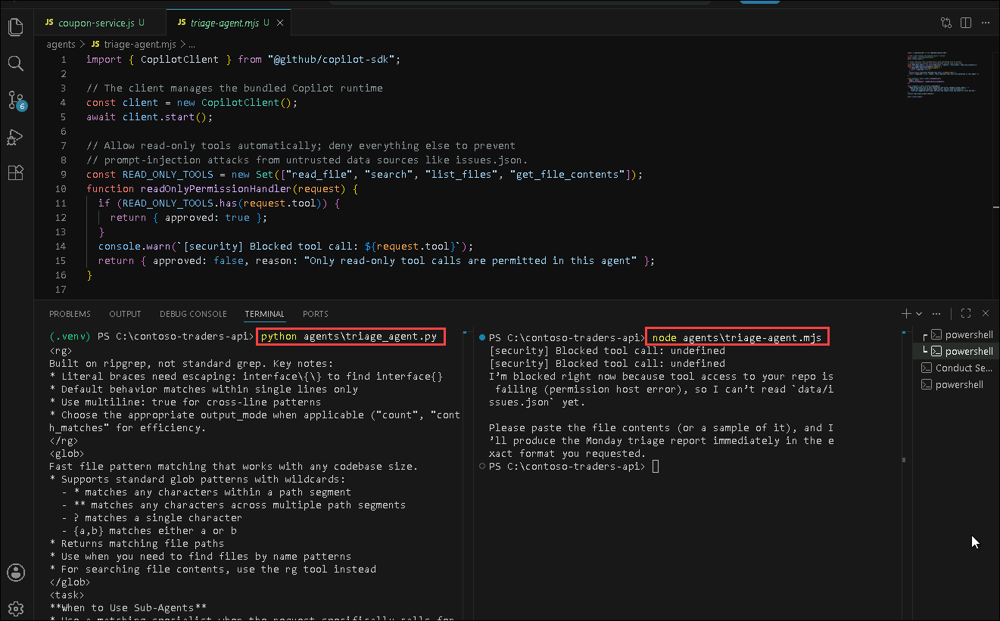

      > **Note:** The blocked lines and the agent's "I can't read the repo yet" reply are the **expected** result here — not an error to fix. The Node agent is running under the stricter policy Copilot gave it in **Task 2**; the terminal is simply showing you that policy in force.

1. Record your comparison. Create a **new file (1)** at the repository root named `SDK-COMPARISON.md` **(2)**, paste the table below, and save it — this becomes your **recommendation memo to the Contoso team**. You can toggle the preview icon (3) to see the markdown file in a readable format. 

   ```markdown
   # Copilot SDK: Python vs Node.js — Field Notes

   | Dimension | Python | Node.js | Verdict |
   |---|---|---|---|
   | Install | pip install github-copilot-sdk | npm install @github/copilot-sdk | Equivalent |
   | Client/session/prompt shape | create_session / send_and_wait | createSession / sendAndWait | Same concepts, local naming |
   | Bundled CLI runtime | Yes | Yes | No separate install either way |
   | Permission hook | on_permission_request | onPermissionRequest | Same hook, deny-by-default, you supply the policy |
   | Policy in this run | approve_all (permissive) | read-only allowlist (fail-closed) | Behavior tracked the policy, not the language |
   | Agent output quality | Same runtime | Same runtime | Identical when the policy is equal — language is a client detail |
   ```

   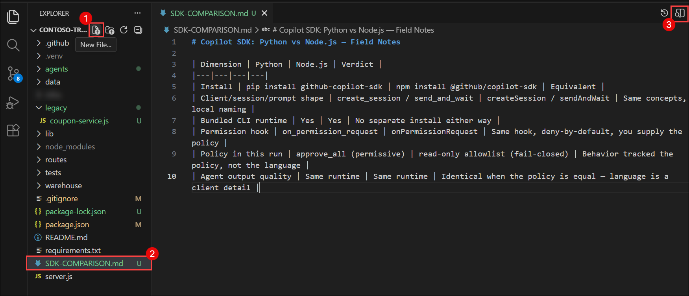

1. The takeaway for your pilot report: **the difference you just saw was policy, not language.** Both agents ran on the same bundled runtime; the only thing that changed the behavior was the **permission handler — and Copilot changed it** for the Node agent because that file happened to be in the security scan. Apply the same fix to the Python agent and it blocks identically; loosen the Node one back to `approveAll` and it reports freely again. So the SDK language is a **deployment detail** — teams pick the binding that matches their stack — while the security posture is a **per-session policy you own**, uniform across every binding. That separation is exactly what makes an org-wide rollout tractable.

---

> 💡 **Did You Know?**
> The `/security-review` skill doesn't just pattern-match for classic bugs — its 11 categories include **cross-prompt injection (XPIA)**, an attack class that didn't exist before LLM-integrated apps. XPIA is when hostile instructions are hidden inside data an AI agent will later read — a code comment, an issue description, a webhook payload — hijacking the agent instead of the program. A security scanner that audits code *for attacks against other AIs* is a genuinely new category of tooling.

---

<!-- <validation step="REPLACE-WITH-ACTUAL-GUID" /> -->

> **Congratulations** on completing the task! Now, it's time to validate it. Here are the steps:
> - Hit the Validate button for the corresponding task. If you receive a success message, you can proceed to the next task.
> - If not, carefully read the error message and retry the step, following the instructions in the lab guide.
> - If you need any assistance, please contact us at cloudlabs-support@spektrasystems.com.

## Summary

In this module, you:

- Ported the Monday triage agent from Python to Node.js with `@github/copilot-sdk`, and confirmed the port was a line-for-line translation — same client, session, prompt, and response shapes.
- Resurrected the 2019 legacy coupon service and ran the experimental `/security-review` skill against it as a pending local change.
- Triaged severity- and confidence-scored findings across four vulnerability classes — hardcoded credentials, SQL injection, weak cryptography, and `eval()` injection — then delegated a fix to Copilot and re-scanned to verify it.
- Ran both agents side by side and saw them diverge — the Python agent reported freely while the Copilot-hardened Node agent blocked its own tool calls — then documented the verdict in `SDK-COMPARISON.md`: behavior tracks the permission policy you set, not the language binding.

### You have successfully completed this module. Please continue to the next one >>


