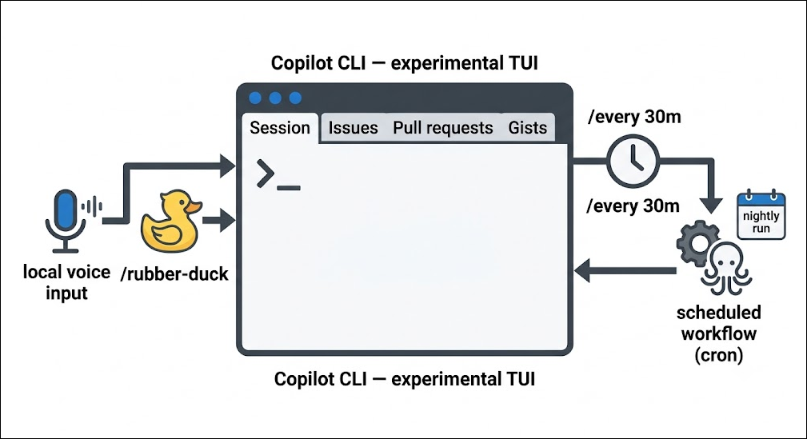

# Exercise 3: Copilot CLI: TUI, Voice & /every Scheduling

### Estimated Duration: 60 Minutes

## Scenario

The pilot is gaining fans. The storefront developers loved the SDK demo — but they live in their terminals, and their verdict was blunt: *"If the agent isn't in my shell, it doesn't exist."* Meanwhile, the ops team wants the triage report to just *appear* every morning without anyone remembering to run a script. Both wishes shipped at Build 2026: the Copilot CLI got a redesigned text-based UI with tabs, local voice input, a `/rubber-duck` critic, and — the ops team's dream — `/every`, a scheduler for recurring agent runs. Today you make the terminal the agent's home.

## Overview

In this module, you will explore the redesigned Copilot CLI text-based UI (TUI), including its tabbed views for Issues, Pull requests, and Gists. You'll drive the CLI hands-free with local voice input, get your code critiqued by the rubber duck, and finally put agent runs on a schedule with `/every` — then back the schedule with a GitHub Actions workflow so it survives beyond your terminal session.

## Objectives

You will be able to complete the following tasks:

- Task 1: Navigate the redesigned Copilot CLI text-based UI (TUI)
- Task 2: Drive the CLI with voice input for common developer tasks
- Task 3: Schedule a recurring agent run with /every, backed by GitHub Actions

## Architecture Diagram



## Task 1: Navigate the redesigned Copilot CLI text-based UI (TUI)

The old CLI was a prompt; the new one is a workspace. In this task, you'll switch on the experimental interface and discover that your issues, pull requests, and gists now live one Tab keypress away from your agent session — then put the famous rubber duck to work on your Module 2 code.

1. In VS Code, open a terminal (**Terminal > New Terminal**) in the **contoso-traders-api** folder and start the Copilot CLI:

   ```
   copilot
   ```

1. If experimental mode isn't still active from Module 2, enable it again:

   ```
   /experimental on
   ```

   The interface refreshes into the redesigned TUI: a cleaner layout, theme-aware colors, and — the headline change — **tabs** across the top of the session.

   

   > **Note:** The experimental TUI is still evolving, so minor visual differences from the screenshots are expected. If the layout looks unchanged, exit with `/exit`, run `copilot update`, and start again.

1. Press the **Tab** key. Because you're running the CLI inside a GitHub repository, it cycles from the default **Session** view to the **Issues** tab — your repository's open issues, rendered right in the terminal.

   

1. Press **Tab** again to reach the **Pull requests** tab, and once more for **Gists**. Press **Tab** a final time to cycle back to **Session**. No browser, no context switch — the repository's state lives alongside your agent conversation.

   

1. The TUI also ships accessibility-focused color modes (default, github, dim, high-contrast, colorblind). Explore the visual settings — then pick whichever mode reads best on your screen:

   ```
   /theme
   ```

   

1. Now for the critic. In the **Session** tab, invoke the rubber duck on the code you wrote in Module 2:

   ```
   /rubber-duck review agents/triage-agent.mjs — is this production-ready for a team rollout?
   ```

1. Read the duck's feedback. Unlike a normal prompt, `/rubber-duck` invokes a dedicated **critic agent** — it doesn't edit anything; it interrogates your code and surfaces what a sharp reviewer would: missing error handling around `client.start()`, no timeout on the agent call, the hardcoded prompt string.

   

   > **Note:** Rubber-duck debugging is the old practice of explaining your code line-by-line to a toy duck until you spot the bug yourself. Copilot's version talks back.

## Task 2: Drive the CLI with voice input for common developer tasks

Contoso's accessibility guild has been asking about hands-free workflows since the pilot began — and honestly, some prompts are just faster to say than to type. Copilot CLI's voice input runs **entirely on your machine**: audio is transcribed locally and never leaves the VM.

1. Still inside the Copilot CLI session, start a voice recording with the keyboard shortcut: press **Ctrl+X**, release, then press **V**.

1. The first time you use voice input, the CLI guides you through downloading the local speech-to-text runtime. Follow the on-screen prompts and wait for the download to complete.

   

   > **Important:** Voice input requires a microphone reaching the Lab VM. In the browser-based lab client, allow microphone access when prompted (check the browser's address-bar permission icon if no prompt appears). **If no microphone is available in your environment, don't get stuck:** read each voice step, then type the same prompt instead — every outcome in this task can be reached by keyboard, and you can revisit voice input on your own machine later.

1. With recording active, speak a prompt naturally, then press any key to stop:

   > *"List the files in the routes folder and explain what each endpoint does."*

   The CLI transcribes your speech locally and inserts it at the prompt. Press **Enter** to send it.

   

1. Try the second, quicker gesture: **hold the spacebar**, dictate — *"run the test suite and summarize any failures"* — and release. Press **Enter** to send.

   

1. Approve the command execution when Copilot asks for permission to run `npm test`, and read the summary it returns. You just went from spoken sentence to executed developer task without touching the keyboard for anything but confirmation.

   > **Note:** Notice that Copilot still asked before running a command. Voice changes the input, not the safety model — the permission gate applies to every channel.

## Task 3: Schedule a recurring agent run with /every, backed by GitHub Actions

The ops team's wish: a triage report that shows up on its own. `/every` turns any prompt into a recurring agent run right from the CLI — and for schedules that must survive your terminal closing, the repository's GitHub Actions workflows provide the durable backstop. You'll set up both layers.

1. Still in the Copilot CLI session, schedule a recurring agent run — type the following and press **Enter**:

   ```
   /every 30m read data/issues.json and post a one-paragraph triage summary, flagging anything high-severity
   ```

   Copilot confirms the schedule: the prompt will now re-run every 30 minutes in this session.

   

1. Schedules you can't see are schedules you can't trust. Open the **schedule manager** by running the command with no arguments:

   ```
   /every
   ```

   The manager lists your active schedules — the 30-minute triage run should be there. This is also where you'd delete a schedule you no longer want.

   

   > **Note:** `/every` has a sibling: `/after` runs a prompt **once** after a delay (for example, `/after 2h check whether the CI run finished`). Both are managed from the same schedule manager.

1. Keep the schedule running and exit the CLI when you're ready to move on:

   ```
   /exit
   ```

1. A CLI schedule lives only as long as your session — fine for a workday, wrong for ops. For a schedule with no laptop attached, back it with GitHub Actions — which means your work needs to live in a repository **you own**. The codebase on your VM was cloned from a shared, read-only source, so you'll publish your own copy into your GitHub Enterprise account now. In the Edge browser, open a new tab and go to:

   ```
   https://github.com/new
   ```

1. Create the repository:

   - **Repository name:** `contoso-traders-api`
   - **Visibility:** **Private**
   - Leave **Add a README**, **.gitignore**, and **license** all unchecked (your local project already has these files)
   - Click **Create repository**

   

1. On the **Quick setup** page that appears, copy the HTTPS repository URL (it looks like `https://github.com/<your-username>/contoso-traders-api.git`).

1. Back in the VS Code terminal, set your Git identity, point the project at your new repository, and push everything you've built. Replace `<REPO-URL>` with the URL you just copied:

   - **Your GitHub user name:** <inject key="GitHub User Name" enableCopy="true"/>

   ```
   git config --global user.name "<your-github-username>"
   git config --global user.email "<your-github-username>@users.noreply.github.com"
   git remote set-url origin <REPO-URL>
   git add .
   git commit -m "Add SDK agents, hardened coupon service, and comparison notes"
   git branch -M main
   git push -u origin main
   ```

   

   > **Note:** `git remote set-url origin` re-points the project from the shared source to your own repository, so your push lands in the copy you own. If Git opens a browser window to authorize the credential manager, click **Sign in with your browser** — you're already signed in to GitHub, so it completes in one click.

1. In VS Code's Explorer pane, expand **.github > workflows**, right-click the **workflows** folder, select **New File...**, and name it `nightly-triage.yml`.

1. Paste the following workflow and save. It runs the test suite on a nightly cron — the durable, serverless twin of your `/every` schedule:

   ```yaml
   name: Nightly Triage

   on:
     schedule:
       - cron: "0 6 * * *"   # every day at 06:00 UTC
     workflow_dispatch:        # allow manual runs for testing

   jobs:
     triage:
       runs-on: ubuntu-latest
       steps:
         - uses: actions/checkout@v4
         - uses: actions/setup-node@v4
           with:
             node-version: 20
         - name: Install dependencies
           run: npm install
         - name: Run test suite
           run: npm test
         - name: Surface the issue backlog
           run: |
             echo "## Nightly issue backlog" >> $GITHUB_STEP_SUMMARY
             node -e "const i=require('./data/issues.json'); i.filter(x=>x.severity==='high').forEach(x=>console.log('- [HIGH] '+x.title))" >> $GITHUB_STEP_SUMMARY
   ```

1. Commit and push the workflow:

   ```
   git add .github/workflows/nightly-triage.yml
   git commit -m "Add nightly triage workflow"
   git push
   ```

1. In the Edge browser, open your **contoso-traders-api** repository on GitHub and select the **Actions** tab. You should see the **Nightly Triage** workflow listed alongside **CI**.

   

1. Don't wait for 06:00 UTC — trigger it now. Click **Nightly Triage** in the left sidebar, then click the **Run workflow** dropdown on the right, and click the green **Run workflow** button.

   

1. Refresh the page after a few moments, click into the running workflow, and watch it complete: dependencies install, the test suite passes, and the run summary lists the high-severity backlog.

   

   > **Note:** You now have both scheduling layers the TOC promised: `/every` for interactive, in-session recurrence, and GitHub Actions cron for durable, unattended runs. Real teams use both — the CLI for the developer's rhythm, Actions for the organization's.

---

> 💡 **Did You Know?**
> Copilot CLI's voice input doesn't call a cloud speech API — the CLI downloads a **speech-to-text model that runs entirely on your machine**, which is why the first recording triggers a one-time runtime download. That design choice means your dictated prompts work offline, cost nothing per use, and never ship audio off the device — the same "local-first" pattern that made Git itself beat centralized version control.

---

<!-- <validation step="REPLACE-WITH-ACTUAL-GUID" /> -->

> **Congratulations** on completing the task! Now, it's time to validate it. Here are the steps:
> - Hit the Validate button for the corresponding task. If you receive a success message, you can proceed to the next task.
> - If not, carefully read the error message and retry the step, following the instructions in the lab guide.
> - If you need any assistance, please contact us at cloudlabs-support@spektrasystems.com.

## Summary

In this module, you:

- Enabled the experimental Copilot CLI TUI and navigated its tabbed views — Session, Issues, Pull requests, and Gists — without leaving the terminal.
- Ran the `/rubber-duck` critic agent against your Module 2 code and collected reviewer-grade feedback.
- Drove the CLI hands-free with local voice input using both the Ctrl+X V recording gesture and hold-spacebar dictation.
- Scheduled a recurring agent run with `/every 30m`, inspected it in the schedule manager, and learned its one-shot sibling `/after`.
- Pushed your work to GitHub and backed the in-session schedule with a durable **Nightly Triage** GitHub Actions cron workflow, then triggered and verified a run.

### You have successfully completed this module. Please continue to the next one >>


