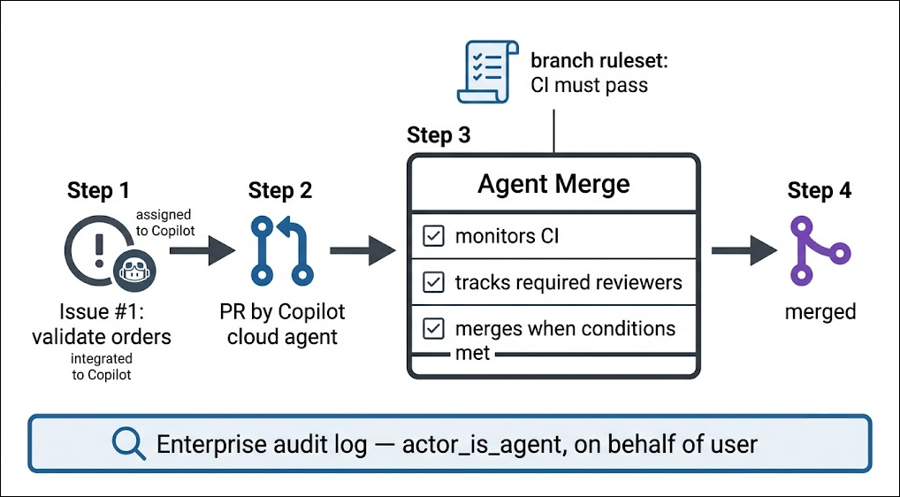

# Exercise 4: Agent Merge Configuration & Audit

### Estimated Duration: 60 Minutes

## Scenario

The pilot's final exam. Contoso's leadership is convinced agents can *write* code — Modules 1–3 proved that. What they don't yet believe is that agents can *ship* code: get a pull request through CI, reviews, and merge without a human babysitting it, and do it under rules the company controls, with an audit trail compliance will sign off on. That's exactly what **Agent Merge** — announced at Build 2026 as part of GitHub's agent-native lineup — is for. Today, an agent fixes a real bug in the Galactic Gadget Shop, Agent Merge walks the pull request home under a branch policy **you** define, and you pull the audit evidence that proves every step. Ship it — governably.

## Overview

In this final module, you will assign a real issue to the Copilot cloud agent and receive a pull request in return, then configure Agent Merge on that PR — choosing exactly how much automation you allow. You'll enforce a governance policy with a branch ruleset in GitHub Enterprise Cloud and watch Agent Merge respect it, review the merge decision trail, and finally audit the agent-driven change end to end — the compliance story that turns a cool demo into a production rollout.

## Objectives

You will be able to complete the following tasks:

- Task 1: Configure Agent Merge for multi-agent pull request workflows
- Task 2: Review merge decisions and enforce governance policy in GitHub Enterprise Cloud
- Task 3: Audit agent-driven changes for compliance before release

## Architecture Diagram



> **Image-generation prompt:** *A flat-design pipeline diagram on a white background, flowing left to right. Step 1: an issue icon labeled "Issue #1: validate orders" with a small robot badge labeled "assigned to Copilot". Arrow to Step 2: a pull request icon labeled "PR by Copilot cloud agent". Arrow to Step 3: a large box labeled "Agent Merge" containing three checklist rows: "monitors CI", "tracks required reviewers", "merges when conditions met". Above the box, a policy scroll icon labeled "branch ruleset: CI must pass". Arrow to Step 4: a merged-PR icon in purple labeled "merged". Below the whole pipeline, a wide bar labeled "Enterprise audit log — actor_is_agent, on behalf of user" with a magnifying glass icon. GitHub palette: dark gray, blue, purple accent for the merge.*

## Task 1: Configure Agent Merge for multi-agent pull request workflows

Remember issue #101 from your Monday triage report — the one your own agent flagged as fix-first? A customer ordered **-3 jetpacks**. Time to close the loop: instead of fixing it yourself, you'll file it as a GitHub issue, hand it to the Copilot cloud agent, and put the resulting pull request under Agent Merge's care.

1. In the Edge browser, open your **contoso-traders-api** repository on GitHub and select the **Issues** tab.

   

1. Click the green **New issue** button.

1. Fill in the issue exactly as follows, then click **Create**:

   - **Title:**

     ```
     Add input validation to POST /api/orders
     ```

   - **Description:**

     ```
     Orders currently accept negative and non-integer quantities — a customer ordered -3 jetpacks (see data/issues.json, issue 101).

     Acceptance criteria:
     - Reject any order item whose quantity is not a positive integer (400 with a clear error message)
     - Reject any order item whose productId does not exist in the catalog (400)
     - Add tests covering both rejection cases and keep the existing Node.js and Python test suites green
     ```

   

1. On the issue page, find the **Assignees** section in the right sidebar, click it, and select **Copilot** from the list.

   

   > **Note:** Assigning an issue to Copilot hands it to the **cloud agent**: it spins up its own GitHub Actions-powered environment, plans the change, writes the code and tests, and opens a pull request — all server-side. Your terminal is not involved.

1. Within a few moments, Copilot reacts with a 👀 emoji on the issue and a linked pull request appears, marked as a draft while the agent works. Click through to the pull request.

   

1. While the agent works, open the **View session** option on the pull request to watch the agent's live session — its plan, the files it's touching, and the tests it's writing. This is multi-agent development in practice: the same repository where your SDK agents ran locally now hosts a cloud agent working a ticket.

   

1. Wait for the agent to finish and mark the pull request **Ready for review** (typically a few minutes — a good moment to skim the diff: `routes/orders.js` gains validation, and new tests appear under `tests/`).

1. Now put the PR under management. On the pull request page, locate the **Agent Merge** option and enable it.

   

1. Choose your automation level. Agent Merge lets you decide which steps the agent may perform — select the full set for this lab:

   - **Drive CI back to green** — if checks fail, the agent diagnoses logs and pushes fixes
   - **Address reviewer feedback** — the agent responds to and resolves review comments
   - **Merge when conditions are met** — once every requirement passes, the agent completes the merge

   

   > **Important:** Do not merge the pull request manually at any point in this module — the whole point is to watch Agent Merge do it under policy. If the PR merges before you finish Task 2, that's Agent Merge working as configured; continue with the tasks against the merged PR.

## Task 2: Review merge decisions and enforce governance policy in GitHub Enterprise Cloud

An agent that merges code is only acceptable if it merges **by the rules**. In this task you'll write the rule — a branch ruleset requiring CI to pass — watch Agent Merge honor it, and then step up a level to see how GitHub Enterprise Cloud governs agents across the whole organization.

1. In your repository, select the **Settings** tab, then in the left sidebar under **Code and automation**, select **Rules > Rulesets**.

   

1. Click **New ruleset > New branch ruleset** and configure it as follows:

   - **Ruleset name:** `protect-main`
   - **Enforcement status:** **Active**
   - Under **Target branches**, click **Add target > Include default branch**
   - Under **Branch rules**, check **Require status checks to pass**, click **Add checks**, and add the **test** check (the job name from your CI workflow)

   

1. Click **Create** at the bottom of the page. From this moment, *nothing* — human or agent — can merge to `main` without green CI.

   > **Note:** This is the governance inversion that makes Agent Merge safe: you don't trust the agent to behave; you make the platform enforce behavior. The agent operates *inside* the same rules that bind every developer.

1. Return to your pull request and watch the **checks section** at the bottom. Agent Merge is now tracking your ruleset's requirements: the CI run must pass before the merge condition is satisfied. The PR's status area shows Agent Merge as active, with the merge held until all conditions clear.

   

1. When CI completes green and all conditions are satisfied, Agent Merge completes the merge. Refresh the PR and examine the **timeline**: the agent's commits, the checks it monitored, the moment conditions were met, and the merge itself — each step attributed and timestamped. This trail *is* the merge decision record.

   

   > **Note:** If CI had failed, your automation level from Task 1 permits Agent Merge to download the failure logs, diagnose them, and push a fix — the "drive CI back to green" loop. With a healthy test suite it usually passes first try; you'll know the loop exists the day a flaky test meets it.

1. Now zoom out from one PR to the whole enterprise. In the top-right corner of GitHub, click your **profile avatar**, select **Your enterprises**, and open the CloudLabs enterprise. In the enterprise navigation, go to **Settings**, then find the **AI controls > Agents** page.

   

   > **Note:** If your lab account doesn't surface the enterprise settings (access varies by role), open your **organization's** settings instead — the same agent controls appear under the organization's **Copilot > Agents** policies. The screenshots show the enterprise view.

1. Explore what the control plane offers an administrator — this is where Contoso's platform team would govern the rollout:

   - **Agent availability** — enable or disable Copilot cloud agent, code review, and custom agents enterprise-wide
   - **Agent sessions** — a filterable list of every agent session across the enterprise in the last 24 hours
   - A pre-filtered link into the **audit log** for agentic events — your next stop

   

## Task 3: Audit agent-driven changes for compliance before release

Contoso's compliance officer has one question before the summer-sale release goes out: *"Prove to me what the agents did, who let them do it, and that nothing merged outside policy."* Everything you need is already recorded — this task is about knowing where to look.

1. Start with the artifact itself. In your repository, open the merged pull request and review its attribution: the PR author is **Copilot**, the issue links back to the human who filed it (you), and the merge event names Agent Merge as the completing actor. Screenshot-worthy evidence, one page.

   

1. Next, the session-level record. Navigate to the agents dashboard by entering this URL in the browser:

   ```
   https://github.com/copilot/agents
   ```

   This page lists your agent sessions — including the cloud-agent session that fixed issue #101 — with status, duration, and links to their pull requests.

   

1. Now the compliance-grade source: the audit log. From your organization's page, go to **Settings**, then in the left sidebar under **Archive**, select **Logs > Audit log**.

   

   > **Note:** Audit log access requires organization-owner (or enterprise-level) permissions. If your lab account cannot open it, follow along with the screenshots — the filter syntax below is the takeaway you'll use in your own organization.

1. In the audit log search bar, filter to agent activity only — enter the following and press **Enter**:

   ```
   actor_is_agent:true
   ```

   

1. Examine the entries for your pull request's lifecycle. Every agentic event carries the fields compliance cares about:

   | Field | What it answers |
   |---|---|
   | `actor_is_agent: true` | "Was this action taken by an agent?" |
   | `user` / `user_id` | "**On whose behalf** did the agent act?" |
   | `action` (e.g., `pull_request.merge`) | "What exactly did it do?" |
   | timestamp + repository | "Where and when?" |

   The chain is complete: a human filed the issue → an agent authored the fix → Agent Merge merged it under a ruleset → and every link is attributable to a named user. No anonymous robots.

1. Close the loop for the release. Use the **Export** dropdown on the audit log page to download the filtered events (JSON or CSV) — that file, plus the PR timeline, is the evidence package Contoso's compliance officer asked for. The summer sale ships.

   

---

> 💡 **Did You Know?**
> Every entry in GitHub's audit log now answers the question *"human or agent?"* natively — the `actor_is_agent` field was added because enterprises adopting coding agents discovered their existing audit tooling couldn't tell an agent's merge from a person's. Crucially, agents never act as anonymous service accounts: each event also records the **user the agent acted on behalf of**, so accountability always resolves to a person. It's the same principle aviation settled decades ago — autopilot flies the plane, but a named captain is always on the flight record.

---

<validation step="REPLACE-WITH-ACTUAL-GUID" />

> **Congratulations** on completing the task! Now, it's time to validate it. Here are the steps:
> - Hit the Validate button for the corresponding task. If you receive a success message, you can proceed to the next task.
> - If not, carefully read the error message and retry the step, following the instructions in the lab guide.
> - If you need any assistance, please contact us at cloudlabs-support@spektrasystems.com.

## Summary

In this module, you:

- Filed a real bug as a GitHub issue and assigned it to the **Copilot cloud agent**, which planned, coded, tested, and opened a pull request server-side.
- Enabled **Agent Merge** on the pull request and configured its automation level — CI recovery, feedback handling, and conditional merge.
- Enforced governance with a branch ruleset requiring green CI, and watched Agent Merge complete the merge only after your policy was satisfied.
- Toured the enterprise **Agents control plane** — availability policies and session monitoring across the organization.
- Audited the agent-driven change end to end with `actor_is_agent:true`, traced every action to the human it acted on behalf of, and exported the compliance evidence package.

## What You Learned in This Lab

Four hours ago, agents couldn't touch the Galactic Gadget Shop. Look at the pipeline you've built since:

- **Module 1** — You embedded the Copilot agent runtime in a Python project with the GA Copilot SDK: client, session, prompts, streaming, and custom tools the agent calls at its own discretion.
- **Module 2** — You proved the SDK is language-portable by porting the workflow to Node.js line-for-line, and you turned Copilot into a security reviewer — scanning the legacy coupon service with `/security-review`, then delegating and verifying the fix.
- **Module 3** — You moved agents into the developer's natural habitat: the redesigned Copilot CLI TUI with its tabbed views, the `/rubber-duck` critic, local voice input, and recurring runs via `/every` backed by a durable GitHub Actions schedule.
- **Module 4** — You graduated agents from writing code to **shipping** it: a cloud agent fixed a real issue, Agent Merge walked the pull request through CI and merge under a branch ruleset you enforced, and the enterprise audit log attributed every action to an agent *and* the human behind it.

That's the full arc of agentic development as announced at Build 2026 — **build agents in any language, run them anywhere you work, schedule them to run without you, and govern them like any other engineer on the team.** You've done every step hands-on, on a real enterprise, with real governance. Take the pattern home: your own repositories are one `pip install` — or `npm install` — away.

### You have successfully completed the lab!


